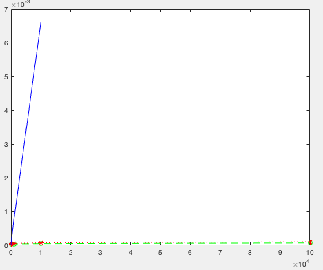

### Performance Testing

10,000 range queries and point updates were randomly run on the Segment Trees in both iterative and recursive types, as well as a bruteforce solution for sum of integers. Although the updates are extremely fast for bruteforce solutions (`a[pos] = val`), the queries are

| Elements  | Iterative | Recursive | Bruteforce |
| ------------- | ------------- | ---| ---|
|10         | 2.4490950000000002  | 2.048737000100001 |1.7962190000000002 |
| 100       | 3.4964069999999996 | 4.163335000000001 | 10.821088000000003 |
| 1000       | 4.0019469999999995 | 5.336650000000001| 78.02953800000003 |
| 10000     | 4.8206940000000005 | 7.000550999999999 |662.3366150000002 |
| 100000    | 6.6271949999999980 | 9.949820000000004| NA|

The above data plotted for Iterative (green), Recursive (red) and Bruteforce (blue)

Same plot but zoomed in, notice the bruteforce timings rising steeply on the left.

For both updates as well as queries, iterative remains faster practically than the same recursive segment tree.
